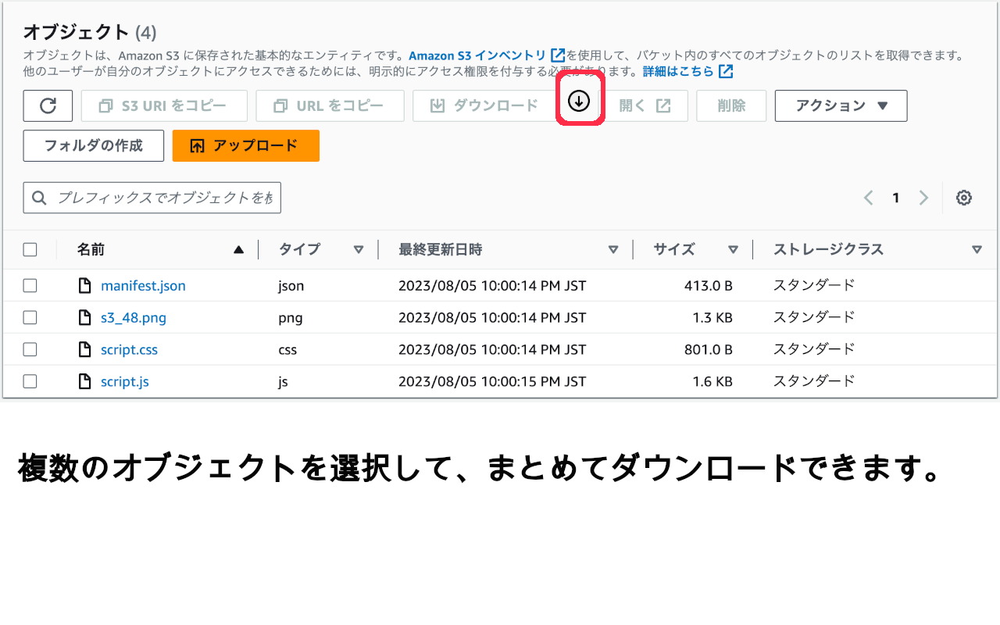

# S3 Batch Downloader

[](https://chromewebstore.google.com/detail/hkfgcimbcdngoekajjianmgelbhlckch)
[](https://chromewebstore.google.com/detail/hkfgcimbcdngoekajjianmgelbhlckch)

AWSマネジメントコンソールのS3画面で、複数のオブジェクトを一括でダウンロードできるChrome拡張機能です。

AWSコンソール標準のダウンロードボタンは1ファイルずつしかダウンロードできませんが、この拡張機能を使えば、チェックを入れた複数ファイルをワンクリックで順次ダウンロードできます。



## 機能

- ✅ 複数オブジェクトを選択して一括ダウンロード
- ✅ フォルダ（プレフィックス）の再帰ダウンロード（設定でon/off切替）
- ✅ S3画面に専用ダウンロードボタンを追加
- ✅ ページリロード不要（SPA遷移に対応）
- ✅ 多言語対応（日本語・English・中文）

## インストール

[Chrome ウェブストア](https://chromewebstore.google.com/detail/hkfgcimbcdngoekajjianmgelbhlckch)からインストールしてください。

## 使い方

1. S3バケットのオブジェクト一覧画面を開く
2. ダウンロードしたいオブジェクトにチェックを入れる
3. 丸いダウンロードボタン（↓）をクリック
4. 選択したオブジェクトが順次ダウンロードされます

### 再帰ダウンロード

フォルダを選択した場合、中のファイルを再帰的にダウンロードできます。

1. 拡張機能アイコンをクリックして設定画面を開く
2. 「フォルダ再帰DL」をONにする
3. フォルダにチェックを入れてダウンロードボタンをクリック
4. フォルダ内のファイルが自動的にダウンロードされます

## 開発者向け

### ローカルインストール

```bash
git clone https://github.com/qs990lab/s3_multi_dl.git
```

1. Chromeで `chrome://extensions/` を開く
2. 「デベロッパーモード」を有効にする
3. 「パッケージ化されていない拡張機能を読み込む」→ `s3_multi_dl` フォルダを選択

### デプロイ

```bash
bash deploy.sh
# → s3-multi-dl-{version}.zip が生成される
```

### ファイル構成

```
s3_multi_dl/
├── manifest.json    # 拡張機能の設定
├── background.js    # SPA遷移検知・Content Script注入
├── script.js        # メイン機能
├── script.css       # ボタンのスタイル
├── popup.html       # 設定画面
├── popup.js         # 設定画面のロジック
├── s3_48.png        # アイコン（48px）
├── s3_128.png       # アイコン（128px）
└── _locales/        # 多言語対応（日英中）
```

## 注意事項

- AWSマネジメントコンソールの画面構造に依存しているため、AWS側の更新で動作しなくなる可能性があります
- 大量のファイルをダウンロードする際は、ブラウザの設定やネットワーク環境にご注意ください
- 再帰ダウンロードは深い階層やファイル数が多い場合、時間がかかります

## ライセンス

MIT License - [LICENSE](LICENSE)
